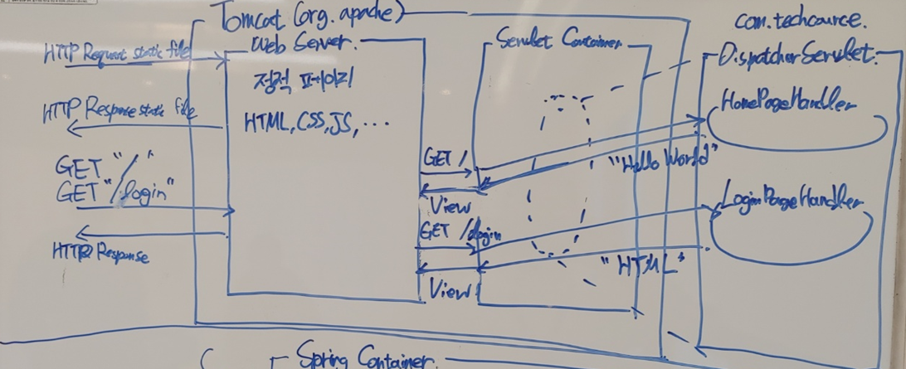

# 1단계 - HTTP 서버 구현하기

### 1. GET /index.html 응답하기

- HTTP Start Line 읽기
  - HTTP Request의 첫 번째 줄을 읽는다.
- HTTP Start Line을 요소 별로 구분하기
  - HTTP method, Request Uri, HTTP version으로 구분하기
- HTTP Request 요청 url에 해당되는 파일을 resource 디렉토리에서 읽는다.

### 2. CSS 지원하기

- '.css' 파일을 받았을 경우, `Content-Type: text/html;charset=utf-8;`로 설정
  - '.js', '.csv' 파일의 경우, `text/javascript`, `image/csv+xml`로 설정함

### 리펙터링

- Tomcat 과 Spring MVC의 구조를 참고하여 전반적인 구조를 설정한다.
  1. ServletContainer에 등록된 핸들러로 요청할 경우, View 객체로 처리한다.
  2. 정적 파일을 요청할 경우, Tomcat 내부에서 처리한다.

- 구조도
  

### 3. Query String 파싱

- `/login?account=gugu&password=password`으로 접속하면 로그인 페이지(login.html)를 보여주기
  - 유저 정보('account', 'password')가 레포지토리 정보와 일치할 경우, 로그를 남딘다.
